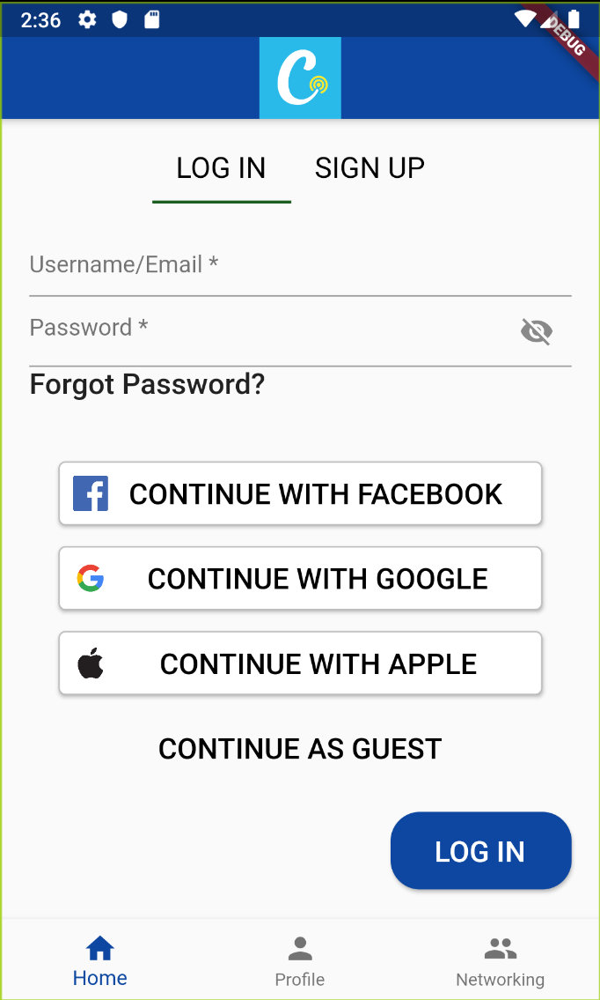
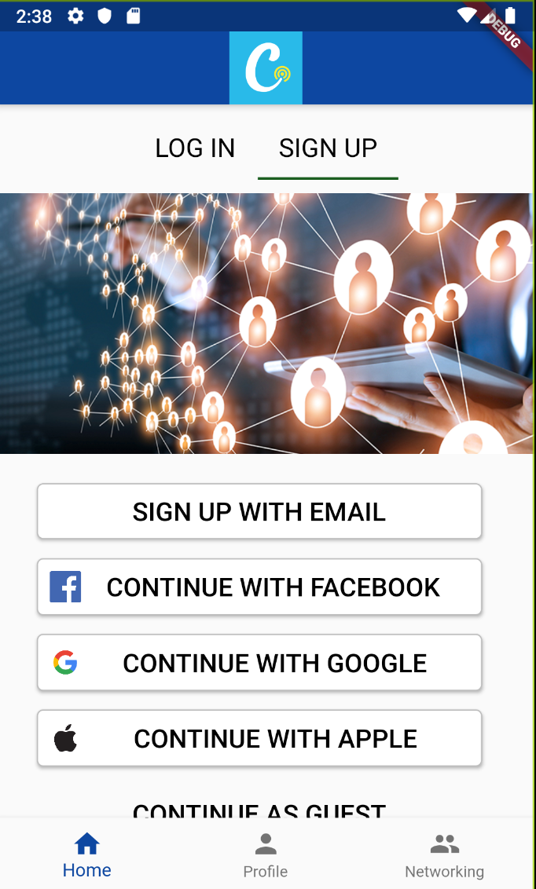
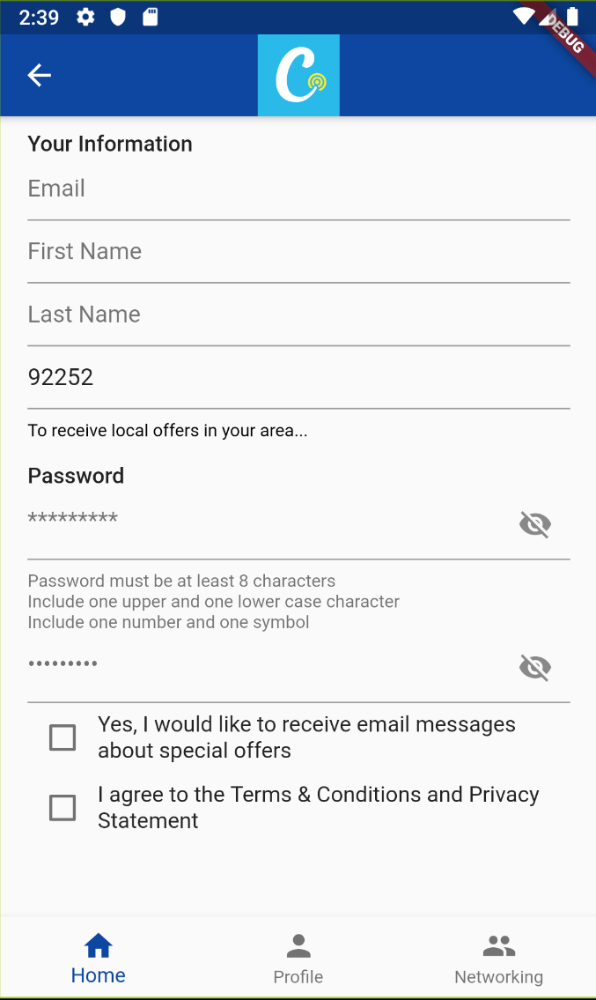
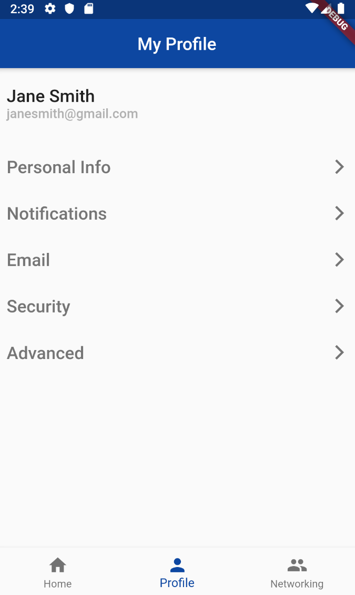
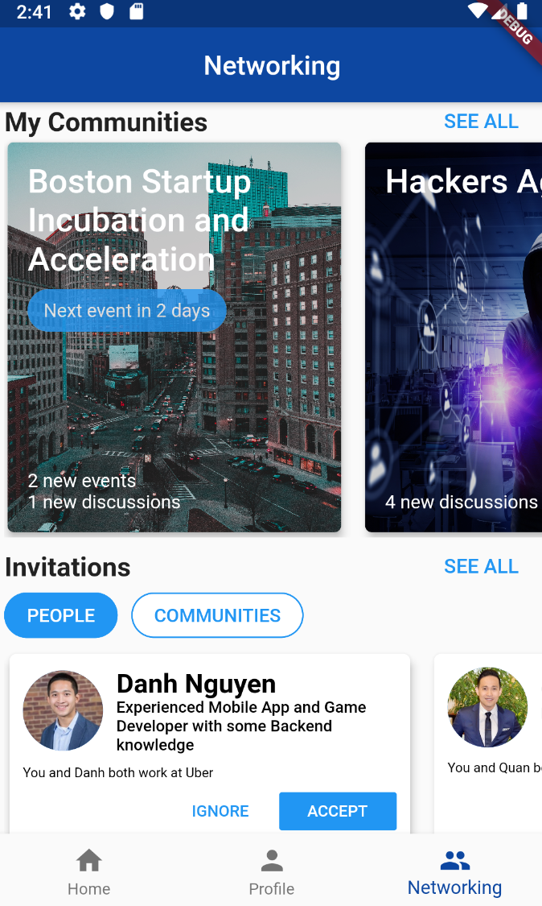

# demo1_app

A flutter application that focus specifically on UI development

## Getting Started

This project is a starting point for a Flutter application.

A few resources to get you started if this is your first Flutter project:

- [Lab: Write your first Flutter app](https://flutter.dev/docs/get-started/codelab)
- [Cookbook: Useful Flutter samples](https://flutter.dev/docs/cookbook)

For help getting started with Flutter, view our
[online documentation](https://flutter.dev/docs), which offers tutorials,
samples, guidance on mobile development, and a full API reference.

### Installing

What things you need to install the software and how to install them

```
1. Flutter sdk
2. Editor with Flutter/Dart support (Android Studio or VsCode)
```

### Prerequisites

A step by step series of examples that tell you how to get a development env running

```
1. git clone https://github.com/forgreatness/demo1_app.git
2. Run "flutter pub get" within the root of project
```

### Pages

1. #### Home

<p float="left">
  
   
  
</p>

2. #### Profile



3. #### Networking



## Built With

* [Flutter](https://flutter.dev/) - Google’s UI toolkit for building beautiful, natively compiled applications for mobile, web, and desktop from a single codebase.

## Authors

* **Danh Nguyen** - *Initial work* - [forgreatness](https://github.com/forgreatness)

## License

## Acknowledgments

* Thanks to [bizz84](https://github.com/bizz84/nested-navigation-demo-flutter?source=post_page-----90eb6caa6dbf----------------------) for guidence on multi navigators. 